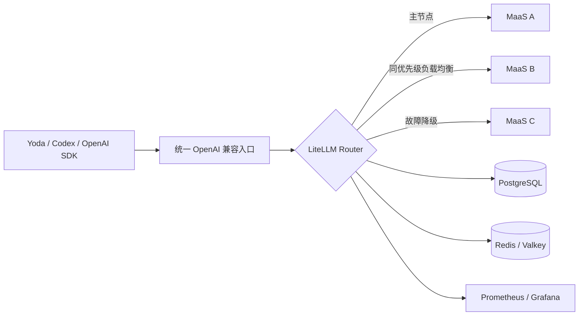

# 多 MaaS 统一管理与自动路由方案

## 1. 结论摘要

首选方案：**LiteLLM Proxy**。

它最适合独立开发者统一管理大量 OpenAI 兼容 MaaS：提供统一 API、模型别名、管理界面、虚拟密钥、费用统计、负载均衡、健康检查、自动降级和 PostgreSQL/Redis 高可用部署。LiteLLM 支持把多个相同 `model_name` 的上游自动组成路由池，并提供优先级、最低负载、延迟、成本等策略。[LiteLLM 路由文档](https://docs.litellm.ai/docs/proxy/load_balancing)

但需要区分两种选择：

- 个人、小团队、多种异构 MaaS：选 **LiteLLM Proxy**。
- 已经有 Kubernetes、并发较高、特别看重 SSE 长连接和网关数据面稳定性：选 **Higress AI Gateway**。
- 需要中文充值、用户、渠道运营后台：考虑 **New API**，但它不是本需求下的稳定性首选。
- 不建议一开始使用“根据提示词智能选择模型”的语义路由。先做好确定性的健康检查、优先级和故障转移。

## 2. 需求理解与假设

- 所谓 MaaS，主要是不同 Base URL、API Key 的 OpenAI 兼容中转服务。
- 需要向 Yoda、Codex、OpenAI SDK 等客户端暴露一个固定 `/v1` 地址。
- 自动路由首先解决宕机、限流、延迟和额度问题，而非自动猜测用户应该用什么模型。
- 暂时不包含对外售卖、充值和复杂计费系统。
- 目标是自托管、避免绑定某家商业网关。

## 3. 模块拆分

| 模块 | 目标 | 推荐路线 |
|---|---|---|
| MaaS 注册 | 管理 Base URL、密钥、模型和优先级 | LiteLLM 模型管理 |
| 统一模型目录 | 屏蔽不同站点的模型命名差异 | 稳定模型别名 |
| 自动路由 | 负载均衡、限流避让、主备切换 | LiteLLM Router |
| 健康管理 | 自动摘除故障节点 | 后台健康检查、冷却和告警 |
| 权限与额度 | 客户端不接触上游密钥 | 虚拟密钥、预算和速率限制 |
| 状态存储 | 配置、调用和费用记录 | PostgreSQL |
| 多实例共享 | 共享限流、路由、冷却状态 | Redis 或 Valkey |
| 可观测性 | 延迟、错误率、上游命中率 | Prometheus、Grafana |
| 密钥管理 | 避免密钥进入配置和日志 | 环境变量或云 Secret Manager |

## 4. 推荐架构

建议的路由顺序：

1. 先按协议能力分组，例如 Chat Completions、Responses、工具调用、图像和音频。
2. 再按真实模型版本分组，不能只相信 MaaS 展示的模型名称。
3. 相同模型、相同优先级的节点使用 `simple-shuffle` 或 `least-busy`。
4. 主服务设置 `order: 1`，备用服务设置 `order: 2`。
5. 对超时、429、5xx 做一次重试，然后进入冷却并切换节点。
6. 跨模型降级必须显式配置，避免 Sonnet 请求悄悄变成能力明显不同的模型。
7. Codex、Responses API 等有服务端状态的场景，需要会话黏性；同一线程不要每次随机切换 MaaS。

LiteLLM 已提供主动健康路由：后台探测失败后，可以在真实用户请求到达前摘除异常节点。[健康检查路由文档](https://docs.litellm.ai/docs/proxy/health_check_routing)

## 5. 技术选型

按需求适配、开发体验、维护健康、可靠性、成本、安全和运维复杂度加权：

| 方案 | 适配 | 开发体验 | 维护 | 可靠性 | 成本 | 安全 | 运维 | 综合 |
|---|---:|---:|---:|---:|---:|---:|---:|---:|
| LiteLLM | 5.0 | 4.5 | 4.0 | 4.5 | 4.5 | 3.0 | 4.0 | **4.35** |
| Higress | 4.3 | 3.5 | 4.5 | 4.8 | 4.8 | 4.5 | 2.5 | **4.18** |
| Portkey Gateway | 4.1 | 4.4 | 3.6 | 4.4 | 4.2 | 4.0 | 4.2 | **4.13** |
| New API | 4.6 | 4.4 | 4.1 | 3.3 | 3.2 | 3.4 | 4.2 | **4.00** |

### LiteLLM：首选

优势：

- 原生支持 OpenAI 兼容自定义端点，只需配置 `api_base`、`api_key` 和上游模型。[自定义端点文档](https://docs.litellm.ai/docs/providers/openai_compatible)
- 支持优先级、负载均衡、重试、冷却、主动健康检查、模型降级。
- 自带模型管理、虚拟密钥、预算和使用统计。
- 多实例可以共享 PostgreSQL 和 Redis；官方生产架构建议至少两个无状态副本。[生产部署文档](https://docs.litellm.ai/docs/proxy/deploy)
- 核心代码为 MIT，企业目录采用单独许可：[v1.94.0 许可文件](https://github.com/BerriAI/litellm/blob/v1.94.0/LICENSE)。

注意：2026 年 3 月曾发生 PyPI 供应链事件，受影响版本为 `1.82.7` 和 `1.82.8`；官方 Docker 镜像未受影响，后续重建了发布链路。[官方事件说明](https://docs.litellm.ai/blog/security-update-march-2026)

因此部署要求是：

- 使用官方 Docker 镜像。
- 当前可从 `v1.94.0` 开始验证，验证后固定镜像 digest。
- 禁止使用 `latest` 或运行时无版本 `pip install`。
- 用 Cosign 校验镜像签名；当前发布页给出了官方校验命令。[v1.94.0 发布页](https://github.com/BerriAI/litellm/releases/tag/v1.94.0)

### Higress：高稳定性备选

Higress 基于 Envoy 和 Istio，采用 Apache-2.0，并且是 CNCF 沙箱项目；支持管理控制台、多模型统一协议、负载均衡、Fallback、Token 限流和观测能力。它更适合 Kubernetes、长连接和高并发数据面。[Higress 仓库](https://github.com/higress-group/higress)、[AI Gateway 功能](https://higress.io/en/ai-gateway)

主要代价是组件更多、学习和运维成本更高。已有 K8s 时，它可能反超 LiteLLM 成为首选。

### 其他方案

- **Portkey Gateway**：MIT，嵌套路由、条件路由、熔断和 Guardrails 表达力很好；但部分完整管理、组织和治理能力偏向托管或企业版本，而且 Gateway 2.0 仍处于预发布迁移阶段。[Portkey 仓库](https://github.com/Portkey-AI/gateway)
- **New API**：中文管理体验很好，支持渠道优先级、权重、多密钥轮询和自动禁用。[渠道管理文档](https://docs.newapi.pro/en/docs/guide/feature-guide/admin/channel) 但采用 AGPLv3 和额外品牌保留要求，项目文档也明确说明开源版本不承诺稳定性与支持，因此更适合渠道运营，不作为本次稳定性首选。[许可说明](https://github.com/QuantumNous/new-api/blob/main/README.md)
- **One API**：架构和能力相对旧，不建议新项目从它开始。
- **语义路由器**：属于后期成本优化层，不能替代 MaaS 健康检查和故障转移。

## 6. 实施路线

| 阶段 | 周期 | 工作内容 | 验收标准 |
|---|---:|---|---|
| POC | 0.5～1 天 | 接入三个 MaaS、一个真实模型 | 可负载均衡并模拟故障切换 |
| V1 | 2～3 天 | PostgreSQL、密钥管理、健康检查、指标 | 单一 Base URL 可供实际客户端使用 |
| 稳定化 | 5～7 天 | 压测、限流、断网、429、5xx、备份、回滚 | 连续运行一周且路由行为可解释 |
| 高可用 | 额外 2～3 天 | 两个 Gateway 副本、外部 Redis/PostgreSQL | 单个实例退出不影响已有入口 |

POC 必须验证：

- 普通与流式 Chat Completions。
- `/v1/responses`。
- 工具调用和结构化输出。
- 客户端主动取消请求。
- 429、401、超时和 5xx。
- 首字延迟、总延迟、错误率和实际模型身份。
- 流式响应中途断开——这类故障通常不适合静默拼接另一家 MaaS，应由客户端明确重试。

## 7. 成本估算

| 形态 | 基础设施 | 估算 |
|---|---|---:|
| 本地 POC | Docker Compose | 接近 ¥0 |
| 单机长期使用 | 2 核 4GB、PostgreSQL、每日备份 | ¥100～300/月 |
| 基础高可用 | 两节点、托管 PostgreSQL、Redis、负载均衡 | ¥600～1800/月 |
| 开发投入 | 接入、测试和监控 | 约 3～7 人天 |

以上不包含各 MaaS 的模型调用费用。

## 8. 主要风险

| 风险 | 应对 |
|---|---|
| MaaS 宣称同名模型，实际版本不同 | 建立能力测试和固定回归题集 |
| 自动重试产生重复计费 | 默认只重试一次，记录每次上游尝试 |
| 流式输出中途故障 | 明确失败并由客户端重试 |
| Responses 状态绑定某个上游 | 按会话做路由黏性 |
| 网关自身成为单点 | 两副本、外部 PostgreSQL/Redis |
| 提示词被日志长期保存 | 默认只记录元数据，正文日志按需开启 |
| 上游密钥集中后风险增大 | Secret Manager、网络隔离、定期轮换 |
| 频繁升级引入回归 | 固定版本和 digest，灰度升级并保留回滚版本 |

## 9. 下一步

最务实的路线是：

1. 先用 LiteLLM 接入你最常用的三个 MaaS。
2. 每家只配置一个完全一致且验证过的模型。
3. 固定 Yoda、Codex 等客户端的 Base URL 到这个 Gateway。
4. 连续采集七天可用率、首字延迟、429 和实际费用。
5. 只有当并发和长连接压力明显上升时，再对比迁移到 Higress。

最终判断：**现在选 LiteLLM，部署上使用“固定签名镜像＋确定性路由＋主动健康检查”；已有成熟 K8s 基础设施时选 Higress。**
